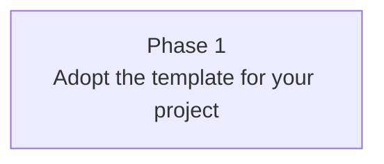

# Phased Execution Plan — Agentic Coding Starter Template

This directory is the phased execution plan for *this* repository. It is the authoritative source for what to build, in what order, and under what invariants.

If you cloned this template to start a new project, replace this `plan/` with your project's plan. Phase 1 here is a placeholder that exists so the first `/kickoff` invocation has something to do; the real first phase is yours to write.

If you opened this repo to use the template directly (Mode B in [`../briefs/BRIEF.md`](../briefs/BRIEF.md)), Phase 1 below leads you through deciding what to build with the template's surfaces.

When `plan/` and the briefs disagree, `plan/` wins — it is the refinement.

- **INDEX.md** (this file) — discovery endpoint: phase dependency graph, the linked phase table with status markers, cross-cutting concerns, critical-files map. **Status markers live here and nowhere else** — each phase file carries `id` / `title` / `depends_on` / `informs` frontmatter but no `status` field.
- **`phase-N.md`** — parent phase: goal and decomposition into sub-phases.
- **`phase-N.M.md`** — sub-phase: Goal, Deliverables, Acceptance, brief refs, and (for completed phases) Outcomes.

## Reading protocol

If you are working on a phase:

1. Read this `INDEX.md` (cross-cutting concerns apply to every phase).
2. Read the parent `phase-N.md` to understand the larger context (when a sub-phase is targeted).
3. Read the target `phase-N.md` (or `phase-N.M.md`).
4. Read every brief listed under that phase's "Brief refs" section — those are the contracts the phase implements.
5. Read every file listed under `depends_on` in the frontmatter.
6. Do **not** slurp every `phase-*.md`. The frontmatter and brief refs are the contract for which predecessors and contracts actually matter.

## Phase Dependency Graph

The graph contains a single placeholder phase. Replace it with your project's real phasing as soon as Phase 1 is replaced by real work. A typical second phase looks something like "land the first slice of <your-real-feature>", but the methodology says not to commit to that shape until Phase 1 has actually finished.

## Phase Table

Status legend: ⏳ Not Started · ⬅️ Next (only one at a time) · 🚧 In Progress · ✅ Completed.

| Phase                  | Title                                | Status |
|------------------------|--------------------------------------|--------|
| [Phase 1](phase-1.md)  | Adopt the template for your project  | ⬅️     |

`/kickoff` flips `⬅️` → `🚧` on start, `🚧` → `✅` on completion, and advances the next `⏳` row to `⬅️` per this dependency graph. Status does not live in per-phase frontmatter.

## Cross-Cutting Concerns (apply to every phase)

These are the universals the template ships with. A project derived from this template inherits them and may add more.

- **Briefs are the contract.** Every phase points at one or more files under `briefs/` for the canonical design. Phase files specify *how to build* the brief's design; they do not re-specify it. If a brief is ambiguous or wrong, fix the brief — don't work around it.
- **Policies are the law.** Every phase honors every file under `policies/`. A policy violation blocks acceptance.
- **Status lives in one place.** `plan/INDEX.md`'s phase table is the single source of truth for `⏳ / ⬅️ / 🚧 / ✅`. Per-phase frontmatter does not carry `status:`.
- **Acceptance is empirical** (see [`../policies/acceptance-empirical.md`](../policies/acceptance-empirical.md)). Verifiable shell commands and named manual checks — not "the code compiles."
- **Repo-relative paths only** in any file committed to this repo (see [`../policies/repo-relative-paths.md`](../policies/repo-relative-paths.md)). Bash invocations may use absolute paths.
- **Cross-harness parity** (see [`../policies/cross-harness-parity.md`](../policies/cross-harness-parity.md)). The same canonical files drive Claude Code, Codex CLI, and any other harness. Mirrors do not get hand-edited.
- **Human decides done** (see [`../policies/human-in-the-loop.md`](../policies/human-in-the-loop.md)). `/kickoff` never auto-commits, never advances past unresolved gates, never claims subjective acceptance.
- **Log discipline** (see [`../policies/log-discipline.md`](../policies/log-discipline.md)). `LOG.md` is append-only and owned by `/kickoff`.

## Critical-Files Map

| Concern                              | Location                                                  |
|--------------------------------------|-----------------------------------------------------------|
| Entry-point brief                    | [`../briefs/BRIEF.md`](../briefs/BRIEF.md)                |
| Methodology                          | [`../briefs/methodology.md`](../briefs/methodology.md)    |
| Bootstrap a new project              | [`../briefs/agentic-bootstrap.md`](../briefs/agentic-bootstrap.md) |
| Top-level agent guidance             | [`../CLAUDE.md`](../CLAUDE.md)                            |
| Activity log                         | [`../LOG.md`](../LOG.md)                                  |
| Phase orchestrator                   | [`../.claude/skills/kickoff/SKILL.md`](../.claude/skills/kickoff/SKILL.md) |
| New-project bootstrapper             | [`../.claude/skills/starter/SKILL.md`](../.claude/skills/starter/SKILL.md) |
| Methodology slash-command            | [`../.claude/skills/methodology/SKILL.md`](../.claude/skills/methodology/SKILL.md) |
| `phase-planner` agent (canonical)    | [`../.claude/agents/phase-planner.md`](../.claude/agents/phase-planner.md) |
| `plan-reviewer` agent (canonical)    | [`../.claude/agents/plan-reviewer.md`](../.claude/agents/plan-reviewer.md) |
| `phase-coder` agent (canonical)      | [`../.claude/agents/phase-coder.md`](../.claude/agents/phase-coder.md) |
| `code-critic` agent (canonical)      | [`../.claude/agents/code-critic.md`](../.claude/agents/code-critic.md) |
| Codex mirrors                        | `../.codex/agents/*.toml`, `../.codex/prompts/*.md`       |
| Example Python project               | `../example/`                                             |
| Example test suite                   | `../tests/`                                               |
| Project metadata                     | [`../pyproject.toml`](../pyproject.toml)                  |
