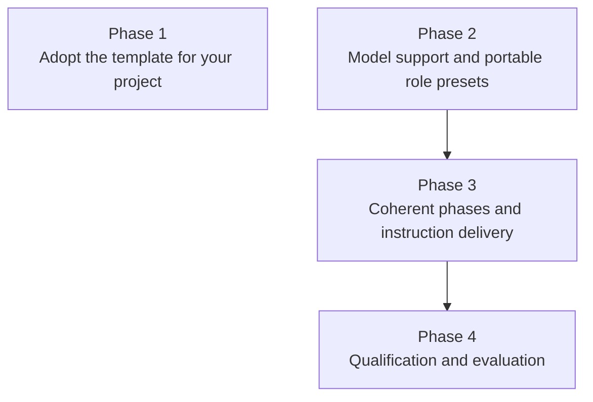

# Phased Execution Plan — Agentic Coding Starter Template

This directory is the phased execution plan for *this* repository. It is the authoritative source for what to build, in what order, and under what invariants.

If you cloned this template to start a new project, replace this `plan/` with your project's plan. Phase 1 here is a placeholder that exists so the first `kickoff` invocation has something to do; the real first phase is yours to write.

If you opened this repo to use the template directly (Mode B in [`../briefs/BRIEF.md`](../briefs/BRIEF.md)), Phase 1 below leads you through deciding what to build with the template's surfaces.

When `plan/` and the briefs disagree, `plan/` wins — it is the refinement.

- **INDEX.md** (this file) — discovery endpoint: phase dependency graph, the linked phase table with status markers, cross-cutting concerns, critical-files map. **Status markers live here and nowhere else** — each phase file carries `id` / `title` / `depends_on` / `informs` frontmatter but no `status` field.
- **`phase-N.md`** — parent phase: goal and decomposition into sub-phases.
- **`phase-N.M.md`** — sub-phase: Goal, Deliverables, Acceptance, brief refs, and (for completed phases) Outcomes.

## Reading protocol

If you are working on a phase:

1. Read this `INDEX.md` (cross-cutting concerns apply to every phase).
2. Read the parent `phase-N.md` to understand the larger context (when a sub-phase is targeted).
3. Read the target `phase-N.md` (or `phase-N.M.md`).
4. Read every brief listed under that phase's "Brief refs" section — those are the contracts the phase implements.
5. Read every file listed under `depends_on` in the frontmatter.
6. Do **not** slurp every `phase-*.md`. The frontmatter and brief refs are the contract for which predecessors and contracts actually matter.

## Phase Dependency Graph

```mermaid
graph TD
    P1[Phase 1<br/>Adopt the template for your project]
    P2[Phase 2<br/>Model support and portable role presets] --> P3[Phase 3<br/>Coherent phases and instruction delivery]
    P3 --> P4[Phase 4<br/>Qualification and evaluation]
```

The adoption placeholder remains available; the operator approved the three sequential template-improvement outcomes on 2026-09-04. Phase 2 does not depend on adopting the template as another product. These phases remain monolithic unless an actual decision or acceptance boundary requires decomposition. **Derived projects** stamped from this template via `stamp` enumerate every major phase the brief surfaces at bootstrap (each as a sketched `plan/phase-N.md` file at lower fidelity), per [`../briefs/methodology.md`](../briefs/methodology.md) §6 and [`../briefs/agentic-bootstrap.md`](../briefs/agentic-bootstrap.md) §8. Sub-phases stay JIT (drafted at parent open via `kickoff` Step 1a) and ripple at every phase close per [`../policies/phase-ripple.md`](../policies/phase-ripple.md).

## Phase Table

Status legend: ⏳ Not Started · ⬅️ Next (at most one) · 🚧 In Progress · ✅ Completed.

| Phase                  | Title                                | Status |
|------------------------|--------------------------------------|--------|
| [Phase 1](phase-1.md)  | Adopt the template for your project  | ⏳     |
| [Phase 2](phase-2.md) | Model support and portable role presets | ✅ |
| [Phase 3](phase-3.md) | Coherent phases and reliable instruction delivery | ⬅️ |
| [Phase 4](phase-4.md) | Integrated qualification and bounded evaluation | ⏳ |

`kickoff` flips `⬅️` → `🚧` on start, `🚧` → `✅` on completion, and advances the next `⏳` row to `⬅️` per this dependency graph. Status does not live in per-phase frontmatter.

Every phase row carries exactly one recognized status. An idle incomplete
project has exactly one `⬅️`; active work may have zero while its executable
row is `🚧`; a complete project has zero; more than one is always invalid.

## Approved improvement work

Operator decision, 2026-09-04: implement the [Astra-era development workflow](../briefs/astra-era-development.md) through phases 2–4. Model routing precedes instruction delivery; integrated qualification follows both. Phase 1 remains the adoption example, not a prerequisite to template maintenance.

## Decomposition ledger (convention)

As a plan grows, this file also records the *why* of its own shape, in prose near the phase table: when a sub-phase is inserted, note when it was drafted, at whose close, what it carved off, what invariant it must preserve, and why the numbering is what it is; when phases are renumbered or reordered, record the event and what it did (and did not) change in the dependency structure; and precede a large phase table with a short critical-path narrative — ordering rationale, parallelism opportunities, and any ratified reversals with their dates. Sub-phase insertion mechanics are governed by [`../policies/phase-ripple.md`](../policies/phase-ripple.md); this ledger is where their rationale survives. A one-phase plan (like this template's) has nothing to record yet.

A mature plan's ledger converges on a small vocabulary of **typed, dated, operator-attributed notes** (observed across ~30 phases in a donor project); use these forms rather than inventing new ones:

- **Deferred-work note** — work identified mid-phase but outside the active write set: record the operator decision date, mark it "not operative during phase N", and state the condition that supersedes it. Deferral notes are how a plan remembers without expanding the active phase (the monotonic-progress invariant's ledger half).
- **Protocol note / protocol gap** — an operator clarification to the orchestration contract, recorded in-plan before (or instead of) graduating to a policy. When one recurs, it is a `lessons/` candidate.
- **Phase launch gate** — a precondition on kicking off an already-`⬅️` phase ("holds the arrow but must not start until X"). Neither a dependency edge nor a status marker; it lives as a dated note naming its conditions.
- **Insertion / renumbering record** — with the **append-only decoder-ring rule**: earlier dated notes keep their original wording; the renumbering note itself states how to read old numbers ("in notes dated before D, 'Phase X' means …"). History is never retroactively rewritten to match new numbering.
- **Slice-outcome note** — at a sub-phase close, what this slice deliberately did *not* do and which later slice owns it.

Large dependency graphs may annotate nodes beyond bare edges: `· GATE` (a phase other work must not pass), `· parallel track`, `· contingent`, `· optional`, epic clusters (disconnected subgraphs labeled `· separate epic`), and dotted edges for soft/optional influence versus solid hard dependencies. Define any annotation the first time it appears.

## Cross-Cutting Concerns (apply to every phase)

These are the universals the template ships with. A project derived from this template inherits them and may add more. The canonical statements live in [`../CLAUDE.md`](../CLAUDE.md) §"Architectural invariants"; this list is a phase-work-flavored restatement for quick reference, not a second authority.

- **Briefs are the contract.** Every phase points at one or more files under `briefs/` for the canonical design. Phase files specify *how to build* the brief's design; they do not re-specify it. If a brief is ambiguous or wrong, fix the brief — don't work around it.
- **Policies are the law.** Every phase honors every file under `policies/`. A policy violation blocks acceptance.
- **Status lives in one place.** `plan/INDEX.md`'s phase table is the single source of truth for `⏳ / ⬅️ / 🚧 / ✅`. Per-phase frontmatter does not carry `status:`.
- **Acceptance is empirical** (see [`../policies/acceptance-empirical.md`](../policies/acceptance-empirical.md)). Verifiable shell commands and named manual checks — not "the code compiles."
- **Assurance is candidate-bound** (see
  [`../policies/orchestration-evidence.md`](../policies/orchestration-evidence.md)).
  Complete first reviews produce stable findings; revision reviews receive
  causal packets and rebase when authority, risk, scope, or continuity
  changes. Iteration uses focused checks; close runs a complete gate against
  the unchanged approved candidate, finalizes tracked bookkeeping, then runs
  a second bare handoff gate against the actual delivered tree. No tracked
  write follows a successful handoff gate.
- **Research authority follows the role** (see
  [`../policies/research-authority.md`](../policies/research-authority.md)).
  Planner/reviewer may search and retrieve; coder/critic retrieve named
  authorities plus same-host structural neighbors. Installed MCP servers and
  plugins are allow-by-default but never presumed present.
- **Operator-input parks are measured separately** (see
  [`../policies/execution-telemetry.md`](../policies/execution-telemetry.md)).
  Every interval and its overlap-safe total appear in the END/report; an open
  interval blocks close.
- **Repository-owned toolchain contract** (see
  [`../policies/build-gates.md`](../policies/build-gates.md)). Setup,
  full/focused testing, runtime selection, metadata, locking, tests, and callers
  move atomically. Focused tests use `./bin/test`; every final claim ends with
  `./bin/check all`.
- **Proof-estate governance** (see
  [`../briefs/test-suite-value-governance.md`](../briefs/test-suite-value-governance.md)
  and [`../policies/test-suite-governance.md`](../policies/test-suite-governance.md)).
  Vital and changed lanes are recipient-local, assay-backed iteration aids;
  invalid or unmapped selection widens to full and both close gates stay full.
- **Repo-relative paths only** in any file committed to this repo (see [`../policies/repo-relative-paths.md`](../policies/repo-relative-paths.md)). Bash invocations may use absolute paths.
- **Cross-harness parity** (see [`../policies/cross-harness-parity.md`](../policies/cross-harness-parity.md)). The same canonical files drive Claude Code, Codex CLI, and any other harness. Mirrors do not get hand-edited.
- **Autonomous delivery, human judgment** (see [`../policies/human-in-the-loop.md`](../policies/human-in-the-loop.md)). `kickoff` commits and fast-forward-pushes work whose gates are all green; it never advances past an unresolved gate, never claims subjective acceptance, and never touches the destructive git surface.
- **Log discipline** (see [`../policies/log-discipline.md`](../policies/log-discipline.md)). `LOG.md` is append-only and owned by `kickoff`.
- **Lessons compound** (see [`../policies/lessons.md`](../policies/lessons.md)).
  Every phase close harvests process observations into the lessons ledger;
  graduation into a binding rule remains human-ratified.

## Critical-Files Map

Shipped files are linked. A file a future phase will create may also appear, as plain text annotated with its phase — e.g. `daemons/watch/` (Phase 6) — so the map is a forward-looking contract, not just an index of what exists.

| Concern                              | Location                                                  |
|--------------------------------------|-----------------------------------------------------------|
| Entry-point brief                    | [`../briefs/BRIEF.md`](../briefs/BRIEF.md)                |
| Methodology                          | [`../briefs/methodology.md`](../briefs/methodology.md)    |
| Incremental orchestration            | [`../briefs/incremental-orchestration.md`](../briefs/incremental-orchestration.md), [`../policies/orchestration-evidence.md`](../policies/orchestration-evidence.md) |
| Bootstrap a new project              | [`../briefs/agentic-bootstrap.md`](../briefs/agentic-bootstrap.md) |
| Top-level agent guidance             | [`../CLAUDE.md`](../CLAUDE.md)                            |
| Pinned third-party documentation     | [`../docs/README.md`](../docs/README.md), [`../policies/docs.md`](../policies/docs.md), [`../bin/check-catalogs`](../bin/check-catalogs) |
| Activity log                         | [`../LOG.md`](../LOG.md)                                  |
| Lessons and maintenance flywheel     | [`../briefs/harness-self-improvement.md`](../briefs/harness-self-improvement.md), [`../policies/lessons.md`](../policies/lessons.md), [`../bin/lessons`](../bin/lessons), [`../bin/check-catalogs`](../bin/check-catalogs), [`../.claude/skills/sweep/SKILL.md`](../.claude/skills/sweep/SKILL.md) |
| Toolchain contract                  | [`../bin/setup`](../bin/setup), [`../bin/test`](../bin/test), [`../bin/check`](../bin/check), [`../bin/check-receipt`](../bin/check-receipt), [`../bin/python`](../bin/python), [`../policies/build-gates.md`](../policies/build-gates.md) |
| Proof-estate reset and governance   | [`../briefs/test-suite-value-governance.md`](../briefs/test-suite-value-governance.md), [`../policies/test-suite-governance.md`](../policies/test-suite-governance.md), [`../tests/proof-estate.yaml`](../tests/proof-estate.yaml), [`../bin/test-governance`](../bin/test-governance), [`../reports/test-governance/starter-reset-summary.json`](../reports/test-governance/starter-reset-summary.json) |
| Optional tracked hooks              | [`../.githooks/pre-push`](../.githooks/pre-push), [`../bin/install-hooks`](../bin/install-hooks) |
| Phase orchestrator                   | [`../.claude/skills/kickoff/SKILL.md`](../.claude/skills/kickoff/SKILL.md) |
| Candidate and evidence managers      | [`../bin/kickoff-tree-id`](../bin/kickoff-tree-id), [`../bin/kickoff-evidence`](../bin/kickoff-evidence) |
| New-project bootstrapper             | [`../.claude/skills/stamp/SKILL.md`](../.claude/skills/stamp/SKILL.md) |
| Methodology skill                    | [`../.claude/skills/methodology/SKILL.md`](../.claude/skills/methodology/SKILL.md) |
| `phase-planner` agent (canonical)    | [`../.claude/agents/phase-planner.md`](../.claude/agents/phase-planner.md) |
| `plan-reviewer` agent (canonical)    | [`../.claude/agents/plan-reviewer.md`](../.claude/agents/plan-reviewer.md) |
| `phase-coder` agent (canonical)      | [`../.claude/agents/phase-coder.md`](../.claude/agents/phase-coder.md) |
| `code-critic` agent (canonical)      | [`../.claude/agents/code-critic.md`](../.claude/agents/code-critic.md) |
| Codex mirrors                        | `../.codex/agents/*.toml`, `../.agents/skills/*` (directory symlinks) |
| Deliverable artifact (self-contained)| `../project/` (per [`../policies/project-isolation.md`](../policies/project-isolation.md)) |
| Example Python package               | `../project/example/`                                     |
| Example test suite                   | `../project/tests/`                                       |
| Project runtime + metadata            | [`../project/.python-version`](../project/.python-version), [`../project/pyproject.toml`](../project/pyproject.toml), [`../project/uv.lock`](../project/uv.lock) |
